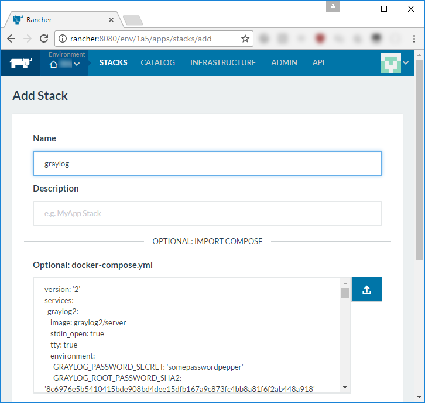

# Quickly deploy [Graylog](https://www.graylog.org/) 2.x in [Rancher](https://rancher.com/docs/rancher/v1.6/en/) 1.6x

This `docker-compose.yml` file is aimed to quickly deploy Graylog instance in development environment. 

## Features

* Use Rancher metadata to correctly bind [rest_transport_uri](http://docs.graylog.org/en/2.2/pages/configuration/web_interface.html) to Rancher host IP.
* Download and install Graylog plugins from GitHub.
* Download [MaxMind GeoLite2 database](http://dev.maxmind.com/geoip/geoip2/geolite2/) and update it on a schedule.
* Disable Graylog's built-in telemetry plugin.

## Batteries included

* [graylog2/server](https://hub.docker.com/r/graylog2/server/)
* [mongo](https://hub.docker.com/_/mongo/) + [mongo-express](https://hub.docker.com/_/mongo-express/)
* [elasticsearch 2](https://hub.docker.com/_/elasticsearch/) + [kopf](https://hub.docker.com/r/lmenezes/elasticsearch-kopf/)
* [geoipupdate](https://hub.docker.com/r/tkrs/maxmind-geoipupdate/)

## Configuration

Graylogs's startup script is used to execute custom startup code, which can be configured via environment variables.

* Port to bind `rest_transport_uri` to.

```yml
REST_TRANSPORT_URI_PORT: '9000'
```

* Disable Graylog built-in telemetry plugin.

```yml
DISABLE_TELEMETRY: '1'
```

* Plugins to download from GitHub. Use `username/repo-name` format. Separate entries by whitespace (space, tab, newline, etc...).

```yml
PLUGINS: |-
  graylog-labs/graylog-plugin-slack
  cvtienhoven/graylog-plugin-aggregates
```

See docs for [graylog2/server](https://hub.docker.com/r/graylog2/server/) image to configure Graylog-specific environment variables.

## Enabling access to KOPF & Mongo Express

KOPF and Mongo Express ports are not exposed by default, since both these services are running without authentication. To enable access, uncomment relevant ports in `docker-compose.yml` (see comments in file).
Note that you should do this only if running locally or in secure enviornment. Never expose those services to the outside world without configuring authentication and encryption.

# Usage

## rancher-compose

1. Open shell
2. Navigate to `rancher-graylog/graylog` folder: `cd /path/to/rancher-graylog/graylog`
3. Create stack: `rancher-compose create`

## Rancher UI

* `STACKS -> Add stack -> Optional: docker-compose.yml`


